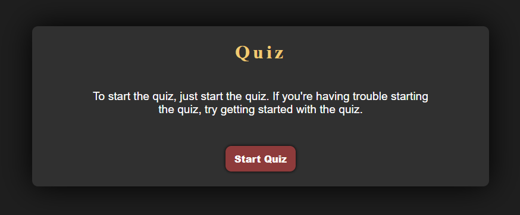

# JavaScript Code Quiz!

This web application tests your JavaScript skills by prompting you with a nifty code quiz. Once launched, click the "Start Quiz" button to get started going through all of the questions. You will have 60 seconds to complete the quiz.

## About Quiz

* **Questions are randomly sorted**
* **Answer choices are randomly sorted**
* **Highscores are saved through local data persistence**

To get started, click on the image below:

After you start the quiz, you should be prompted with a question window that looks like this:

After you complete the quiz, you will be asked to submit your initials to save your score results locally. You will be prompted with this window:

Finally, you will be taken to the highscore records where you can choose to clear all scores or restart the quiz!

Happy quizing!